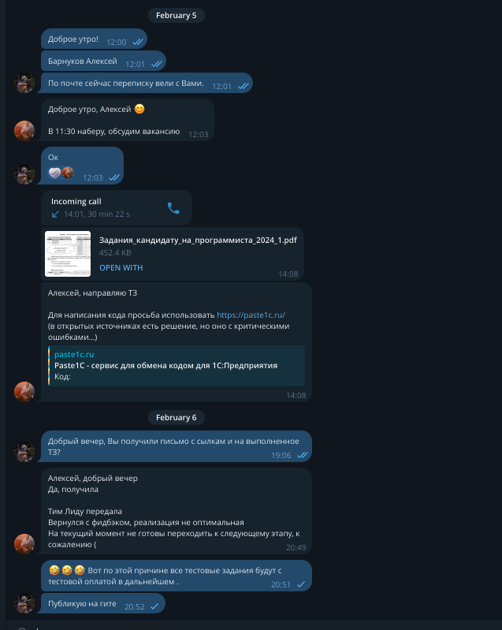

// LICENSE Attribution 4.0 International (CC BY 4.0).
// https://creativecommons.org/licenses/by/4.0/legalcode
// 
// Copyright (c) Alex V. Barnukoff 2025/02/06
1C test kata from 05/02/2025

requyest work pos senjor developer 1c
organization:GRI/SL
command request: retail

contact: A_Peregudova
pos: it recruiter (internal)
Legacy, 1C:Retail

Тестовое задание в Санлайт/ГРИ
Позиция разработчика
Стэк Легаси 1С розница на обычных не управляемых формах
Задача 1

Необходимо написать запросы на 1С или SQL (по желанию) для выборки продук-
ции, которая была отгружена за один период (январь 2021), и не отгружалась за другой
(февраль 2021).
Предложить два варианта запроса:
1. С использованием подзапроса
2. Без подзапросов, и без временных таблиц

Задача 2
Необходимо выполнить проверку на заполнен-
ность обязательных полей:
kkm_uuid;
staff_uuid;
customer_uuid;
receipt;
operation;
bonus;
products;
id;
barcode,
и в сообщении вывести полный путь до поля, ко-
торое не заполнено.

Решения в коде
Ссылка на задание
<a href="./docs/Задания_кандидату_на_программиста_2024_1.pdf">Задачи</a>

Полученный фидбэк

Моя ремарка.
Первое предоставить фидбэк по существу, а именно оптимизации решения со стороны "тимлида", возможного работодателя  не царское это дело. 
По этой причине считаю, что можно в любом случае сказать кандидату - ты говно. Даже не глядя.
Второе, по заверениям рекрутера данная задача расчитана на 40 минут. Будем предельно объективны, по моим расчетам на первый взгляд 2-3 часа. Реальное время выпролнения 2часа 38 минут с и минут 30 еще на причесыванием кода и комментов.
Третье в очередной раз украли три часа, при стоимости часа во франчах, ну усредненно 5К, у меня украли 15К или 150 долларов. Или по факту 3 часа времени. Замечу, самого не восполнимого ресурса.
Учитесь на моих ошибках, цените свое время, не соглашайтесь ни на какие тестовые задания вне рамок собеседований. Как показала практика - если возможный техлид не может потешить свое ЧСВ, и дать
оптимальное с его точки зрения решение, дав фидбэк по оптимизации кода - такого техлида лучше отправить в корзину.

В общем sunlight/GRI - в блэклист работодателей.
